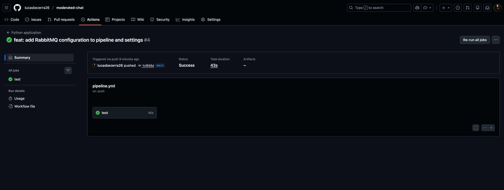

# Chat Moderado - Backend

Sistema de chat em tempo real com moderação assíncrona de mensagens usando arquitetura DDD/Clean Architecture.

## 🚀 Como Executar

Copie o arquivo de variáveis de ambiente:

```bash
cp .env.example .env
```

Configure o provedor de moderação no `.env`:
- `MODERATION_PROVIDER=gemini`: Google Gemini 2.0 Flash (requer `GOOGLE_API_KEY`) - **Padrão**
- `MODERATION_PROVIDER=local`: Dicionário de palavras proibidas (fallback automático)

### Moderação com IA (Gemini)

O Google Gemini detecta 4 categorias de violação:
- **HATE**: Discurso de ódio, racismo, homofobia
- **SEXUAL**: Conteúdo sexualmente explícito
- **VIOLENCE**: Ameaças, incentivo à violência ou autolesão
- **HARASSMENT**: Assédio ou bullying severo

**Exemplo de texto que será rejeitado:**
```
"Eu odeio essas pessoas, elas são inferiores"
```
Categoria detectada: `HATE` - Discurso de ódio

### Fallback Automático

O sistema implementa fallback em cadeia para garantir alta disponibilidade:
1. **Provedor Primário** (configurado via `MODERATION_PROVIDER`)
2. **Fallback Local** (dicionário de palavras) em caso de falha do primário
3. **System Reject** (rejeita por segurança) se todos os provedores falharem

**Cenários de fallback:**
- Timeout na API do Gemini → Usa moderação local
- Quota excedida → Usa moderação local
- API Key inválida → Usa moderação local
- Erro de rede → Usa moderação local

### Ambiente de Desenvolvimento

Utiliza Docker Compose com *bind mounts* para hot-reload e debug facilitado.

```bash
docker-compose up -d --build

```

Disponível em: `http://localhost:8000`

### Ambiente de Produção

Utiliza construção *multi-stage* otimizada para segurança e tamanho de imagem.

```bash
docker-compose -f docker-compose.prod.yml up --build -d

```

**Nota sobre a Arquitetura de Servidor:**
Em produção, optou-se pela utilização do **Gunicorn** atuando como gerenciador de processos (process manager) para orquestrar workers **Uvicorn**. Essa abordagem delega ao Gunicorn a responsabilidade de monitoramento de processos, restarts e gerenciamento de sinais de sistema, enquanto os workers Uvicorn processam o protocolo ASGI necessário para os WebSockets.

---

## 🏛️ Arquitetura e Organização do Código

O projeto é um **Monólito Modular** baseado em **DDD/Clean Architecture** apenas onde a complexidade exige (ex.: moderação). Cada app encapsula sua responsabilidade e expõe apenas interfaces.

### Estrutura de Diretórios
```
app/
├── accounts/               # Autenticação/usuários (API, middleware)
├── chat/                   # Core de mensagens (API, websockets, services)
│   └── services/           # Camada de aplicação
│       ├── message_service.py
│       ├── room_service.py
│       └── broadcast_service.py
├── moderation/             # Moderação (DDD)
│   ├── domain/             # Contratos/estratégias
│   ├── infrastructure/     # Provedores concretos (Gemini, Local)
│   ├── services/           # Orquestração (ModerationService)
│   └── tasks.py            # Celery
└── utils/                  # Utilitários compartilhados (exceptions, pagination)
```

### Decisões por camada
- **Domain (moderation/domain):** regras puras e interfaces (`ModerationStrategy`), sem dependências de framework.
- **Application Services (`*/services/`):** orquestram casos de uso; isolam Views/Consumers da regra de negócio; permitem reuso entre HTTP/WebSocket.
- **Infrastructure (moderation/infrastructure):** detalhes técnicos (APIs, dicionário local) implementando contratos do domínio (DIP).
- **Interface (`api/`, `websockets/`):** valida entrada e delega para Services.

---
### Benefícios da Arquitetura

#### ✅ Extensibilidade
Adicionar OpenAI Moderator requer apenas:
1. Criar `infrastructure/openai.py` implementando `ModerationStrategy`
2. Registrar em `ModerationService._STRATEGIES`


#### ✅ Manutenibilidade
- Mudança na API do Gemini → Afeta apenas `infrastructure/gemini.py`
- Mudança no fluxo → Afeta apenas `services/moderator.py`
## 🏛 Decisões Arquiteturais e Técnicas

### 1. Stack Tecnológica

* **Django 5.2 + DRF**: Framework base, utilizado pela maturidade e ecossistema. A versão 5.2 traz suporte ao ORM Assíncrono (acreate, aexists), permitindo operações de banco de dados não-bloqueantes dentro dos WebSockets (ASGI) sem a necessidade de wrappers de sincronização (sync_to_async), resultando em código mais limpo e performático.
* **Django Channels (ASGI)**: Para gerenciamento de conexões persistentes (WebSockets).
* **Celery + RabbitMQ**: Fila de tarefas para processamento assíncrono da moderação, desacoplando a resposta da API do tempo de inferência da IA.
* **Google Gemini 2.0 Flash**: Moderação de conteúdo via IA generativa com resposta JSON estruturada.
* **Structlog**: Logs estruturados (JSON) para garantir observabilidade em ferramentas de agregação (Datadog/ELK).


Com base no código atualizado (com `acks_late`, timeouts e `select_for_update`) e no texto que você já tinha, aqui está a versão refinada e profissional para o seu README.

Esta versão destaca as decisões de design **Sênior** (resiliência, idempotência e tratamento de falhas distribuídas).

---

### Copie e cole no seu README:

### 2. Pipeline de Moderação e Resiliência

A arquitetura resolve o desafio de moderar mensagens com IA garantindo que a experiência do usuário seja fluida e que as mensagens não sejam perdida, mesmo em cenários de falha.

* **Feedback Otimista (Optimistic UI)**: O WebSocket desacopla a recepção da mensagem do processo de moderação. Ao receber a mensagem, a API confirma o enfileiramento (`message_queued`) e o Frontend a exibe imediatamente como "Pendente", sem bloquear a interface.
* **Estratégia Híbrida com Fallback (Strategy Pattern)**:
* **Primary (Google Gemini 2.0 Flash)**: Analisa contexto, semântica e ironia, retornando um JSON estruturado com veredicto e razões.
* **Fallback (Local Dictionary)**: Em caso de falha do provedor de IA (timeout, cotas ou erros 5xx), o sistema comuta automaticamente para uma validação local baseada em dicionário, garantindo alta disponibilidade.


* **Auditoria Imutável**: Cada decisão de moderação gera um registro em `ModerationLog`, persistindo o *score*, o *payload bruto* da IA e qual provedor foi utilizado, facilitando auditorias e ajustes finos futuros.

### 3. Concorrência, Robustez e Integridade de Dados

Para garantir consistência em um ambiente distribuído com múltiplos workers e retries automáticos, foram aplicados padrões rígidos de engenharia:

* **Garantia de Entrega (`acks_late=True`)**:
O Celery foi configurado com Late Acknowledgment. O worker só confirma o sucesso da tarefa ao broker (RabbitMQ) **após** a conclusão da transação no banco. Se o worker travar ou for reiniciado durante o processamento (ex: OOM ou deploy), a mensagem não é perdida; ela retorna à fila para ser processada por outro worker.
* **Controle de Concorrência (Pessimistic Locking)**:
Como o `acks_late` pode gerar reprocessamento (at-least-once delivery), a idempotência é garantida via banco de dados. Utilizamos `select_for_update(nowait=False)` dentro de uma transação atômica (`transaction.atomic`).
* Isso cria um *row-level lock* no Postgres.
* Se dois workers tentarem processar a mesma mensagem simultaneamente (Race Condition), um aguarda o outro. O segundo worker, ao adquirir o lock, verifica se o status já mudou e aborta a operação, evitando duplicidade de custos de IA ou notificações repetidas.


* **Timeouts e Limites de Execução**:
Para evitar que workers fiquem presos indefinidamente em chamadas de API externas:
* **Soft Time Limit (290s)**: Lança uma exceção controlável para tentar finalizar a tarefa.
* **Hard Time Limit (300s)**: O processo é encerrado forçadamente pelo Celery se exceder 5 minutos, liberando o worker para novas tarefas.


* **Consistência de Leitura (Cursor Pagination)**:
A API de histórico de mensagens utiliza `CursorPagination`. Essa abordagem evita os problemas de consistência da paginação tradicional (`Limit/Offset`) em feeds de tempo real, onde a inserção de novas mensagens poderia causar a duplicação ou salto de itens durante a rolagem do usuário e é mais eficiente em grandes volumes de dados.

## 🧪 Qualidade e Testes

O projeto segue uma pirâmide de testes focada em confiabilidade:

### Testes Unitários (`@pytest.mark.unit`)
- **Não** usam banco de dados, Redis ou Docker
- Mock de dependências externas (APIs, settings)
- **Parametrizados** para eliminar duplicação (DRY)

**Exemplo:**
```python
@pytest.mark.parametrize("content,verdict", [
    ("limpo", "APPROVED"),
    ("idiota", "REJECTED"),
], ids=["clean", "profanity"])
def test_moderate(content, verdict):
    # 1 método, múltiplos cenários
```

### Testes de Integração (`@pytest.mark.integration`)
- Sobem PostgreSQL completo
- Fluxo end-to-end (Consumer → Celery → DB → WebSocket)
- Fixtures compartilhadas para setup comum

### Executar Testes
```bash
pytest              # Todos
pytest -m unit      # Apenas unitários (rápido)
pytest -m integration  # Apenas integração
pytest -v           # Verbose (mostra cada cenário)
pytest --cov=app    # Com coverage
```
### Pipeline CI/CD

O projeto possui pipeline automatizado no GitHub Actions que executa:
- Testes unitários e de integração
- Validação com PostgreSQL e Redis
- Configuração de ambiente isolado



A pipeline garante que todas as alterações passem pelos testes antes de serem integradas ao branch principal.
